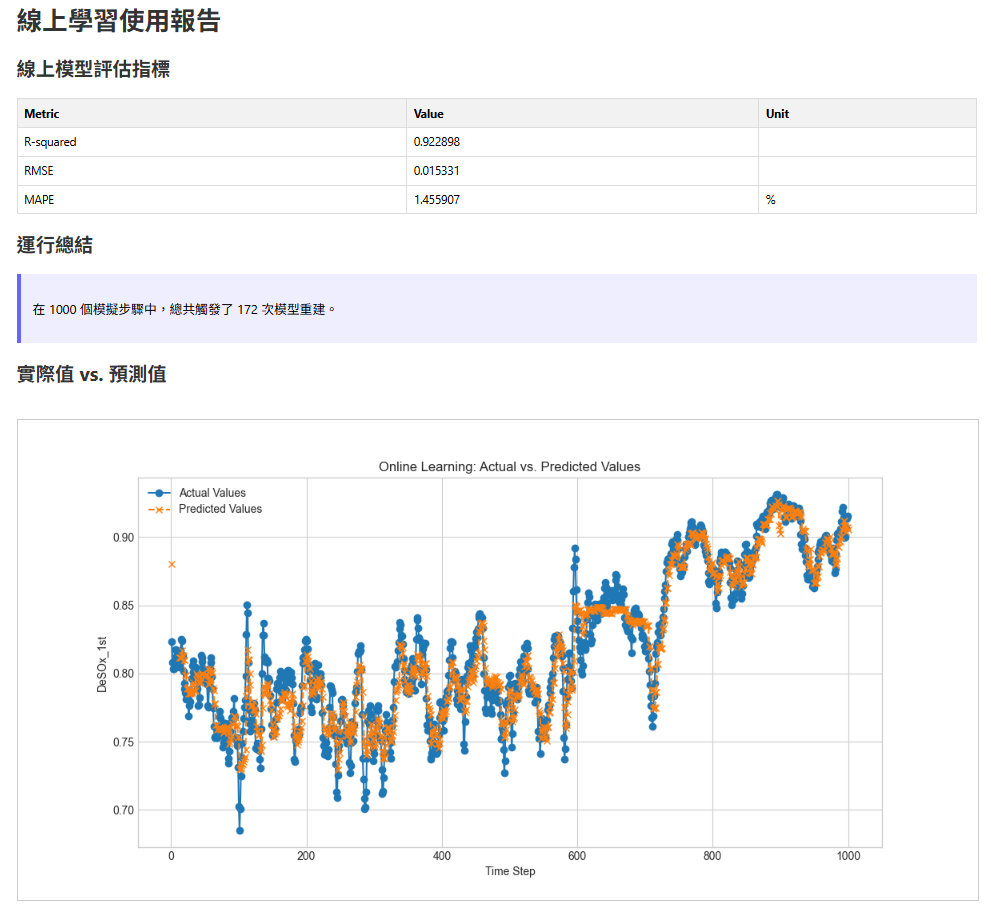
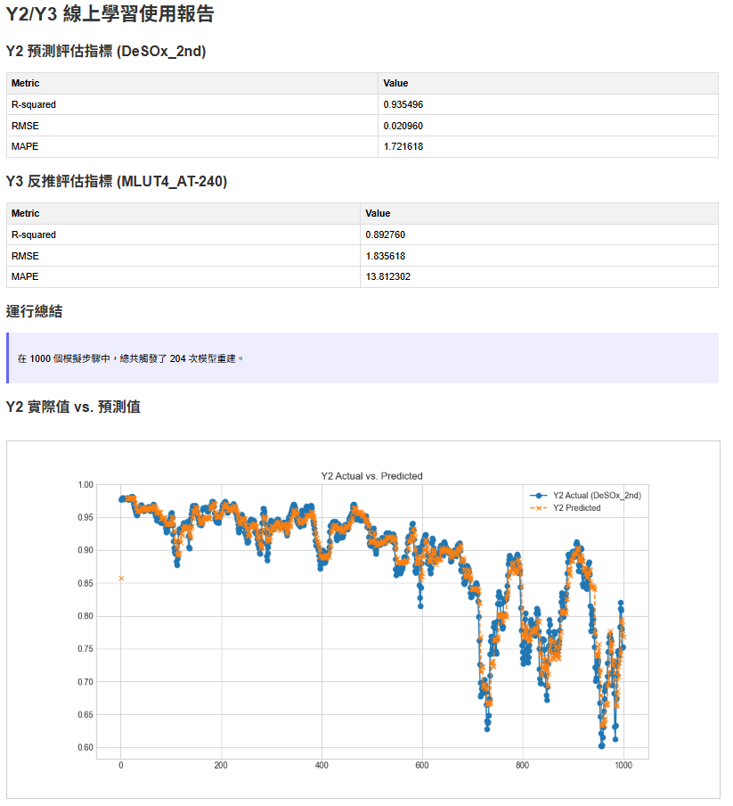
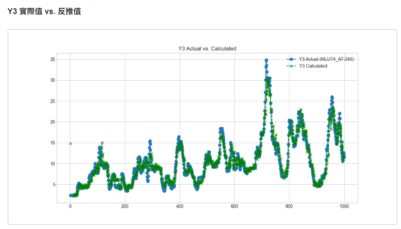

'''# CFB 脫硫劑效率線上學習預測專案

這是一個用於預測 CFB（循環流化床）鍋爐脫硫效率的機器學習專案。其核心是一個能夠進行線上學習（Online Learning）的 XGBoost 模型，能夠根據即時數據不斷調整和優化自身，以適應生產環境中可能發生的動態變化。

---

## 核心功能

本專案從一個基本的批次訓練腳本，逐步演進為一個具備多種先進策略的智慧預測系統：

- **動態模型再訓練**：能夠根據預測誤差，自動判斷是否需要使用最新的數據重新訓練模型。
- **訓練/服務一致性**：透過統一的序列化卡爾曼濾波（Sequential Kalman Filter）處理流程，確保了訓練和線上推論時的數據一致性，解決了嚴重的分佈歪斜問題。
- **樣本加權**：在訓練時給予時間上較新的樣本更高的權重，使模型能更快地適應近期的工況變化。
- **熱啟動 (Warm-up & Reset)**：當真實的線上數據首次進入系統時，能果斷拋棄可能已過時的歷史模型，完全從零開始學習，避免歷史數據的污染。
- **漸進式暖機 (Progressive Warm-up)**：在熱啟動後，將模型的「冷卻時間」從 100 次預測大幅縮短至 10 次，一旦收集到少量新數據便立刻產生可用的「迷你模型」，確保服務近乎不中斷。
- **自動化報告**：能夠為批次訓練和線上模擬分別生成詳細的視覺化報告，包含 R2、RMSE、MAPE 等關鍵指標和圖表，方便對模型性能進行評估。

## 延伸功能：Y2 -> Y3 預測與反推

除了預測 `DeSOx_1st` (Y1) 的主要流程外，本專案還包含一個位於 `Y2/` 資料夾的延伸流程。此流程利用相同的線上學習架構，但目標是：

1.  **預測 Y2**：使用另一組特徵集 (`features2.pkl`) 來訓練模型，以預測第二個目標 `DeSOx_2nd`。
2.  **反推 Y3**：在預測出 `DeSOx_2nd` 後，利用一個簡單的數學公式 `(-DeSOx_2nd * MLUT4_AIC-232B + MLUT4_AIC-232B)` 來反推出第三個值 `MLUT4_AT-240`。

---

## 檔案結構

```
.
├── .gitignore
├── README.md
├── requirements.txt
├── Y1/                           # 主要流程：預測 DeSOx_1st
│   ├── model/
│   │   └── xgb_model.json
│   ├── example_usage.py          # Y1 線上學習與預測的模擬範例
│   ├── features1.pkl             # Y1 模型使用的特徵列表
│   ├── inference.py              # Y1 核心推論與線上學習邏輯
│   ├── train.py                  # Y1 初始模型批次訓練腳本
│   ├── training_report.html      # Y1 訓練報告
│   └── usage_report.html         # Y1 線上模擬使用報告
│
└── Y2/                           # 延伸流程：預測 DeSOx_2nd 並反推 Y3
    ├── model/
    │   └── xgb_model_y2.json
    ├── example_usage.py          # Y2/Y3 線上學習與預測的模擬範例
    ├── features2.pkl             # Y2 模型使用的特徵列表
    ├── inference.py              # Y2/Y3 核心推論與線上學習邏輯
    ├── train.py                  # Y2 初始模型批次訓練腳本
    ├── training_report_y2.html   # Y2 訓練報告
    └── usage_report_y2.html      # Y2 線上模擬使用報告
```

---

## 安裝與設定

1.  **克隆專案**
    ```bash
    git clone https://github.com/skywalker0803r/CFB_online.git
    cd CFB_online
    ```

2.  **(建議) 建立虛擬環境**
    ```bash
    python -m venv venv
    source venv/bin/activate  # 在 Windows 上是 `venv\Scripts\activate`
    ```

3.  **安裝依賴套件**
    ```bash
    pip install -r requirements.txt
    ```

---

## 使用流程

本專案的使用分為兩個獨立的流程：

### Y1 流程 (預測 DeSOx_1st)

#### 階段一：Y1 初始模型訓練

首先，執行 `Y1/train.py` 來訓練一個預測 `DeSOx_1st` 的初始基準模型。

```bash
python Y1/train.py
```

此步驟會產生 `Y1/model/xgb_model.json` 和 `Y1/training_report.html`。

#### 階段二：Y1 線上學習與預測

'''`Y1/example_usage.py` 檔案是一個完整的模擬範例。

```bash
python Y1/example_usage.py
```

此腳本會模擬即時數據的智慧循環，並在結束後產生 `Y1/usage_report.html`。報告範例如下圖所示：


'''

### Y2 流程 (預測 DeSOx_2nd 並反推 Y3)

#### 階段三：Y2 初始模型訓練

執行 `Y2/train.py` 來訓練一個預測 `DeSOx_2nd` 的初始模型。

```bash
python Y2/train.py
```

此步驟會產生 `Y2/model/xgb_model_y2.json` 和 `Y2/training_report_y2.html`。

'''#### 階段四：Y2/Y3 線上學習與預測

`Y2/example_usage.py` 是一個模擬 Y2/Y3 流程的範例。

```bash
python Y2/example_usage.py
```

此腳本會模擬預測 `DeSOx_2nd`，並根據結果即時反推出 `MLUT4_AT-240` 的值，最終產生 `Y2/usage_report_y2.html`。報告中的 Y2 預測與 Y3 反推趨勢範例如下圖：




'''

---

## 開發者使用範例 (Usage Example for Developers)

其他工程師可以輕易地將此線上學習器整合到自己的即時數據處理應用中。核心概念是 `OnlinePredictor` 物件會自己維護模型的狀態、資料緩衝區和誤差歷史。您只需要在迴圈中持續地餵給它新的特徵和舊的答案即可。

以下是一個概念性的範例，以 Y1 流程為例：

```python
import pandas as pd
from Y1.inference import OnlinePredictor
# from Y2.inference import OnlinePredictor # 若要使用 Y2 流程，請改用此行

# 1. 在您的應用程式啟動時，初始化預測器一次
predictor = OnlinePredictor()
last_true_target = None

# 2. 進入您的即時數據處理主迴圈 (例如，每5分鐘執行一次)
while True:
    # 3. 從您的數據源獲取當前特徵 (格式需為單行的 pandas DataFrame)
    #    注意：欄位名稱必須與 features1.pkl (或 features2.pkl) 一致
    current_features_df = get_latest_sensor_data()

    # 4. 呼叫 predict_and_learn 進行預測與學習
    #    - current_features_df: 當前的特徵
    #    - last_true_target: **上一個時間點**的真實答案 (第一次為 None)
    prediction = predictor.predict_and_learn(current_features_df, last_true_target)

    # 拿到預測值後，就可以進行後續應用...
    print(f"最新的預測結果為: {prediction}")

    # 5. 在下一次迴圈開始前，想辦法拿到上一個時間點的真實值
    #    (這通常會有延遲，例如需等待化驗結果)
    last_true_target = get_ground_truth_for_previous_step()
```

在上面的範例中，`get_latest_sensor_data()` 和 `get_ground_truth_for_previous_step()` 是您需要根據自身系統實現的函式，前者用來抓取即時工場數據，後者用來取得對應的真實結果。
'''